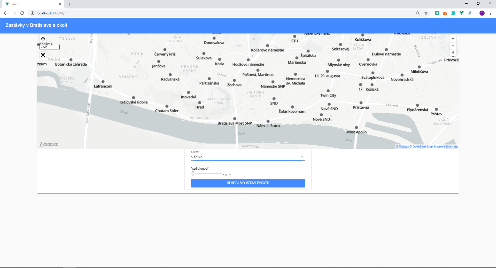

# Overview

Aplikácia zobrazuje zastávky v Bratislave a jej okolí (v okolitıch dedinách). Hlavné scenáre sú:

1. zobrazenie všetkıch zastávok vo zvolenej mestskej èasti
	- Pri naèítaní stránky sa najskôr z databázy vybeu všetky mestské èasti Bratislavy a dediny v okolí mesta. Ich názvy sú poskytnuté pou�ívate¾ovi na vıber v selectboxe. Po vıbere mestskej èasti sa na mape zobrazia všetky zástavky v danej èasti na mape. Zobrazované sú zástavky oboch smerov (reprezentujúce nástupištia).
	- Select pre vıber všetkıch mestskıch èastiach:
```sql
      select  o.name, o.way from planet_osm_point p 
       cross join planet_osm_polygon o 
       where p.public_transport like '%platform%' and o.name is not null and o.admin_level = '9' and ST_contains(o.way,p.way) 
       group by o.way, o.name 
       order by o.name
```
	- Select pre nájdenie všetkıch zastávok v mestskej èasti
```sql
select  p.name,  ST_AsGeoJSON(ST_Transform(p.way, 4326))as geometry from planet_osm_point p 
 cross join planet_osm_polygon o 
 where o.admin_level = '9' and st_equals(o.way, [zadaná way polygónu]) and p.public_transport like '%platform%' and ST_contains(o.way,p.way)
```

2. zobrazenie všetkıch zastávok, ktoré sa nachádzajú na tej ceste, ku ktorej má pozícia pou�ívateåa najbli�šie, a zobrazenie aj tıch zastávok ktoré sa nachádzajú na cestách, ktoré sú prepojené s touto najbli�šou cestou.
	- Po stlaèení tlaèidla na oznaèenie polohy pou�ívateåa (v lavom hornom rohu obrazovky) sa vyh¾adá najbli�šia cesta, ktorá sa od pou�ívateåa nachádza. Následne sa nájdu všetky cesty, ktoré sú prepojené s touto najbli�šou cestou. Na všetkıch tıchto cestách sa vyh¾adajú zastávky a zobrazia na mape.
	- Príklad selectu pre danú pozíciu:

```sql
WITH nierest AS (
select  l.name,l.way, ST_AsGeoJSON(ST_Transform(l.way, 4326))as geometry, ST_distance(ST_GeomFromText('POINT(17.064271599999998 48.15826)',4326)::geography, ST_Transform(l.way,4326)::geography) as distance from planet_osm_line l
where l.highway   is not null
order by distance
limit 30)
SELECT p.name FROM nierest as n
cross join planet_osm_line k
cross join planet_osm_point p
where p.public_transport like '%platform%' 
and st_intersects(k.way, n.way)
and st_contains(k.way, p.way)
```

3. zobrazenie zastávok v zadanej vzdialenosti od aktuálnej poziicie pou�ívate¾a 
	- Pozícia pou�ívate¾a je inicializovaná na stred mapy. Ak sa pou�ívate¾ lokalizuje (ako v scenári 2) tak sa pozícia od ktorej sa budú vyyh¾adáva� najbli�šie zastávky zmení. Následne pou�ívate¾ vyberie vzdialenos� a klikne na modrıy button (pod mapou). Systém vyh¾adá najbli�šie zastávky od pozície pou�ívate¾a a zobrazí ich na mape. 
	- Príklad selectu pre danú pozíciu a vzdialenos� 300 metrov:

```sql
select  p.name, ST_AsGeoJSON(ST_Transform(p.way, 4326))as geometry, ST_distance(ST_GeomFromText('POINT(17.064271599999998 48.15826)',4326)::geography, ST_Transform(p.way,4326)::geography) from planet_osm_point p
where p.public_transport like '%platform%' 
and ST_distance(ST_GeomFromText('POINT(17.064271599999998 48.15826)',4326)::geography, ST_Transform(p.way,4326)::geography) < '300'
```


Takto vyzerá aplikácia v akcii:



Aplikácia sa skladá z dvoch èastí. Frontend je naprogramovanı vo vue.js, v ktorom je vyu�itı mapbox API. Backend je naprogramovanı v node.js, ktorı predstavuje server operujúci nad databázou PostGIS. Frontend komunikuje s backendom pomocou REST volaní.

# Frontend

Frontend je naprogramovanı vo vue.js. Obsahuje mapbox, ktorı zobrazuje zastávky v meste Bratislava ajej blízkom okolí pod¾a daného scenára. 
Všetok relevantnı kód je v balíku `majerechj/assignment-gis/mapavue/map/` prièom zobrazenie mapy a komunikácia s backendom sa nachádzajú v súbore `majerechj/assignment-gis/mapa/vue/map/src/components/Map.vue`

Frontend zabezpeèuje
- zobrazovanie mapy a jej aktualizácie na základe scenárov
- zobrazenie jednoduchého filtra ktorı je umiestnenı pod mapou.
- zobrazenie zastávok na mape je realizované pomocou geojson, ktorı sa vytvára priamo na frontende po volaní REST funkcii na backend, ktorı vracia dáta z databázy

# Backend

Backend je zodpovednı za dopyty nad databázou a vısledné vracanie vısledkov tıchto dopytov na frontend.
Je naprogramovanı pomocou node.js. Jeho hlavnı kód sa nachádza v súbore `majerechj/assignment-gis/mapa/API/server.js`

## Data

Dáta zastávok pochádzajú priamo z OSM databázy, ktorá bola imporotvaná pomocou oms2pgsql. Obsahuje Bratislavu a jej širšie okolie. Ve¾kos� dát je 0,35GB
Geojson je generovanı priamo pri dopytoch nad databázou pou�itím funkcie `st_asgeojson`.


##Indexy
Pre zrıchlenie dopytov boli pou�ité indey nad všetkımi ståpcami `way` v tabu¾kách `planet_osm_point`, `planet_osm_lines` a `planet_osm_polygon` a nad ståpcom `public_transport` v tabulke  `planet_osm_point`
`create index platforms_index on planet_osm_point (public_transport)
create index point_way_index on planet_osm_point (way)
create index polygon_way_index on planet_osm_polygon using gist (way)
create index line_way_index on planet_osm_line using gist (way)`
